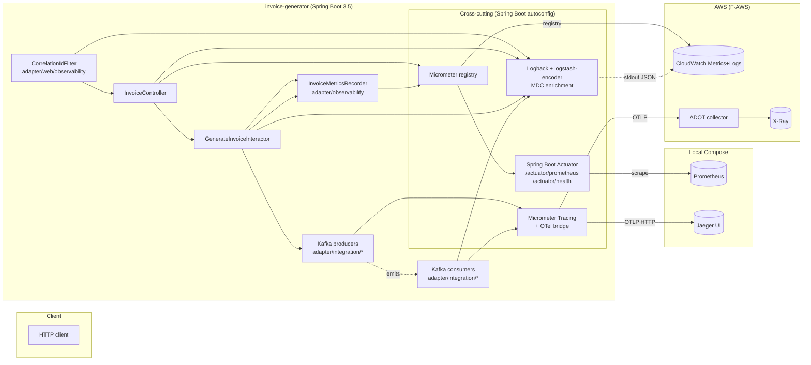

# F-OBSERVABILITY Design

**Spec:** `.specs/features/observability/spec.md`
**Status:** Draft

---

## Architecture Overview

Observability is added as a horizontal concern across the existing Clean Architecture
layers. No domain or use-case interfaces change; instrumentation is wired in the adapter
and configuration layers, and via Logback/Actuator configuration that the domain never
imports.



The same Java code talks to either backend; what changes is the Micrometer registry
dependency and the OTLP endpoint, both controlled by Spring profile (`local` vs `aws`).

---

## Dependency Matrix

Pinned for Spring Boot **3.5.14** (current parent, AD-007). All artifacts below are managed
by Spring Boot's dependency management when present; explicit `<version>` is only required
where Spring Boot does not import the BOM (noted inline).

| Capability | Maven coordinates | Profile | Notes |
| --- | --- | --- | --- |
| Actuator endpoints (`/health`, `/info`, `/prometheus`, `/metrics`) | `org.springframework.boot:spring-boot-starter-actuator` | both | Managed by Boot parent. Selectively expose endpoints via `management.endpoints.web.exposure.include`. |
| Micrometer Prometheus scrape registry | `io.micrometer:micrometer-registry-prometheus` | `local` | Managed. Adds `/actuator/prometheus`. |
| Micrometer CloudWatch registry | `io.micrometer:micrometer-registry-cloudwatch2` | `aws` | Managed. Requires AWS SDK v2 CloudWatch client; provided transitively. |
| Micrometer Tracing + OTel bridge | `io.micrometer:micrometer-tracing-bridge-otel` | both | Managed. Spring Boot 3.5 reference docs name this dependency directly. |
| OTLP span exporter | `io.opentelemetry:opentelemetry-exporter-otlp` | both | Managed. OTLP HTTP default port 4318. |
| Structured JSON logging | `net.logstash.logback:logstash-logback-encoder` | both | **Not in Boot BOM.** Pin to `8.0` (Logback 1.5-compatible, the line Boot 3.5 uses). |
| Spring Kafka (already a dependency under F-DEFECTS-PERFORMANCE) | `org.springframework.kafka:spring-kafka` | both | Carries the Micrometer Observation hooks for KafkaTemplate / listener container. |

**Not adopted (deliberate non-choices):**

- `spring-boot-starter-opentelemetry` — exists only in Spring Boot **4.x**, not 3.5.14
  (verified at the Spring blog and 3.5 reference docs). AD-021 documents this.
- AWS X-Ray SDK for Java — superseded by OTel exporter → ADOT → X-Ray. Avoids a parallel
  tracing API.

---

## Configuration

### `application.yml` (default; safe shared base)

```yaml
spring:
  application:
    name: invoice-generator
  kafka:
    template:
      observation-enabled: true        # OBS-19 producer span + traceparent header
    listener:
      observation-enabled: true        # OBS-20 consumer span from propagated context

management:
  endpoints:
    web:
      exposure:
        include: health,info,prometheus,metrics
      base-path: /actuator
  server:
    port: 8081                         # OBS-08 management on a different port
  endpoint:
    health:
      probes:
        enabled: true
  tracing:
    sampling:
      probability: 1.0                 # full sampling for the challenge; revisit for prod
  observations:
    annotations:
      enabled: true                    # @Observed support if we ever use it

logging:
  config: classpath:logback-spring.xml
  level:
    root: INFO
    br.com.itau.invoicegenerator: INFO
```

### `application-local.yml` (Docker Compose)

```yaml
management:
  otlp:
    tracing:
      endpoint: http://jaeger:4318/v1/traces   # OBS-21
  prometheus:
    metrics:
      export:
        enabled: true                          # OBS-08
```

### `application-aws.yml` (F-AWS will own the full file)

```yaml
management:
  otlp:
    tracing:
      endpoint: http://localhost:4318/v1/traces   # ADOT collector sidecar (OBS-22)
  cloudwatch:
    metrics:
      export:
        enabled: true
        namespace: InvoiceGenerator
        step: 1m
  prometheus:
    metrics:
      export:
        enabled: false
```

### `logback-spring.xml` (root of `src/main/resources`)

```xml
<configuration>
  <appender name="JSON" class="ch.qos.logback.core.ConsoleAppender">
    <encoder class="net.logstash.logback.encoder.LogstashEncoder">
      <includeMdcKeyName>correlationId</includeMdcKeyName>
      <includeMdcKeyName>traceId</includeMdcKeyName>
      <includeMdcKeyName>spanId</includeMdcKeyName>
      <includeMdcKeyName>invoiceId</includeMdcKeyName>
      <includeMdcKeyName>orderId</includeMdcKeyName>
      <customFields>{"service":"invoice-generator"}</customFields>
    </encoder>
  </appender>

  <springProperty scope="context" name="APP_NAME" source="spring.application.name"/>

  <root level="INFO">
    <appender-ref ref="JSON"/>
  </root>
</configuration>
```

Spring Boot auto-populates `traceId` / `spanId` into MDC when Micrometer Tracing is on
the classpath (`management.tracing.enabled=true` by default once the bridge is present),
so the encoder only needs to opt them in by name.

---

## Code Reuse Analysis

### Existing components leveraged

| Component | Location | How it's reused |
| --- | --- | --- |
| `InvoiceController` | `adapter/web/InvoiceController.java` | Wrapped by `CorrelationIdFilter`; no change to method signatures. |
| `ApiExceptionHandler` | `adapter/web/ApiExceptionHandler.java` | Domain-rejection codes (`UNSUPPORTED_TAX_REGIME`, `INVALID_TAX_REGIME`, `INVALID_DELIVERY_REGION`) become the `reason` tag on `invoice.rejected` — single source of truth. |
| `GenerateInvoiceInteractor` | `application/GenerateInvoiceInteractor.java` | Instrumentation is **outside** this class (a Spring-aware `InvoiceMetricsRecorder` wraps or is called from the adapter layer) so `application/` stays Spring/Micrometer-free per AD-009. |
| `InvalidInvoiceOrderException` | `domain/exception/` | The `codigo` field already enumerates the bounded rejection reasons used as a metric tag (OBS-11, cardinality table). |
| Kafka producers (F-DEFECTS-PERFORMANCE) | `adapter/integration/*` | `spring.kafka.template.observation-enabled=true` activates the producer span and `traceparent` injection with no code change in adapter classes. |
| Kafka consumers (F-DEFECTS-PERFORMANCE) | `adapter/integration/*` | Listener container Observation creates the consumer span; a thin `MdcRestoringRecordInterceptor` lifts `correlationId` from Kafka headers into MDC for log enrichment. |

### CONCERNS.md cross-checks

- **C-6 (sync side effects):** F-OBSERVABILITY's SLI-4 timer (`invoice.sideeffect.duration`)
  is the per-leg latency signal the concern said was missing. Wires up only after
  F-DEFECTS-PERFORMANCE lands the Kafka boundary.
- **C-8 (lost interrupt flag):** the new exception-aware tracing (OBS-23
  `recordException` + ERROR status) is the second observability hook for adapter sleep
  sites, but the actual fix still belongs to F-DEFECTS-PERFORMANCE.

---

## Components

### `CorrelationIdFilter`

- **Purpose:** Read or generate the request correlation ID, push it to MDC, and echo it on the response. (OBS-01, OBS-02, OBS-03)
- **Location:** `adapter/web/observability/CorrelationIdFilter.java`
- **Interfaces:**
  - `doFilter(ServletRequest, ServletResponse, FilterChain)` — `OncePerRequestFilter` subclass.
- **Behavior:**
  1. If `X-Correlation-Id` header is present and matches `^[A-Za-z0-9_-]{1,128}$`, adopt it; otherwise generate a `UUID.randomUUID().toString()`.
  2. Put `correlationId` in MDC.
  3. Set the same header on the response.
  4. Always `MDC.remove("correlationId")` in `finally`.
- **Dependencies:** none beyond Servlet API + SLF4J MDC.
- **Reuses:** Spring's `OncePerRequestFilter`.
- **Ordering:** registered before Micrometer's `WebMvcMetricsFilter` so the correlation ID is in MDC for the request-timing log.

### `MdcRestoringRecordInterceptor`

- **Purpose:** On the Kafka consumer side, restore `correlationId`, `invoiceId`, and `orderId` from Kafka headers into MDC before listener execution. (OBS-05)
- **Location:** `adapter/integration/observability/MdcRestoringRecordInterceptor.java`
- **Interfaces:** implements `org.springframework.kafka.listener.RecordInterceptor<String, byte[]>`.
- **Behavior:**
  1. Read `correlationId`, `invoiceId`, `orderId` headers from the record.
  2. If `correlationId` is missing, synthesize one and WARN ("event missing correlationId, synthesized").
  3. Put them in MDC; clear in `success` / `failure` / `afterRecord`.
- **Dependencies:** SLF4J MDC, Spring Kafka API.
- **Reuses:** Spring Kafka's interceptor SPI; no change to consumer business logic.
- **Trace context note:** Trace context (`traceId`, `spanId`) is restored by Spring Kafka's listener Observation automatically — not by this interceptor.

### `InvoiceMetricsRecorder`

- **Purpose:** Increment the four business counters and the dispatch/side-effect timers with cardinality-safe tags. (OBS-10, OBS-11, OBS-12, OBS-13, OBS-14, OBS-16, OBS-26)
- **Location:** `adapter/observability/InvoiceMetricsRecorder.java`
- **Interfaces:**
  - `void recordGenerated(TaxRegime, Region, PersonType, int itemCount)`
  - `void recordRejected(String reasonCode)`
  - `Timer.Sample startDispatch()`
  - `void recordDispatch(Timer.Sample, String topic, boolean success)`
  - `void recordSideEffect(String topic, long producerPublishEpochMillis)` (called from consumer)
- **Dependencies:** `io.micrometer.core.instrument.MeterRegistry`.
- **Cardinality enforcement:** the recorder accepts strongly-typed enums for tax regime / region / person type. The String-typed parameters (`reasonCode`, `topic`) are validated against an allow-list at registration time; unknown values are rejected with a runtime exception (caught by tests, not in prod traffic, because the allow-list comes from `TaxRegime` / `Region` / `RejectionCode` / topic constants).
- **Reuses:** existing `TaxRegime`, `Region`, `PersonType` enums; `InvalidInvoiceOrderException.codigo` for the rejection reason codes.

### Where the recorder is called from

- **Web adapter** (`InvoiceController` / `ApiExceptionHandler`) — knows the rejection
  reason code and the success path. Calls `recordGenerated` after a 2xx and
  `recordRejected` from the exception handler before mapping to HTTP.
- **Kafka producer adapters** — wrap each `KafkaTemplate.send(...)` in a `Timer.Sample`
  and record success/failure on the producer's `whenComplete` callback.
- **Kafka consumer adapters** — record `invoice.sideeffect.duration` from the producer
  publish timestamp Kafka header to consumer acknowledgement.

The recorder is in the **adapter** layer so `application/GenerateInvoiceInteractor` stays
free of Micrometer imports (AD-009).

### `ObservabilityConfig`

- **Purpose:** Wire profile-specific bits: filter registration, recorder bean, Logback MDC keys allow-list for testing, Micrometer common tags (`application=invoice-generator`, `env=local|aws`). (OBS-09 histogram buckets, OBS-16 cardinality enforcement)
- **Location:** `adapter/config/ObservabilityConfig.java`
- **Interfaces (Spring `@Bean`s):**
  - `MeterRegistryCustomizer<MeterRegistry> httpServerRequestsHistogram()` — configures `percentilesHistogram=true`, `serviceLevelObjectives` at 300/800/2000 ms, and percentiles 0.5/0.95/0.99 only on meters whose id starts with `http.server.requests`.
  - `MeterRegistryCustomizer<MeterRegistry> commonTags(Environment env)` — emits `application` and `env` tags on every meter.
  - `FilterRegistrationBean<CorrelationIdFilter> correlationIdFilter()` — registers the filter with `Ordered.HIGHEST_PRECEDENCE`.
- **Dependencies:** `MeterRegistry`, `Environment`.

### `docs/observability.md` (new)

- **Purpose:** Operator-facing documentation of the SLI catalog, the Prometheus query per SLI, and the burn-rate runbook entries. (OBS-31)
- **Owner of contents:** F-OBSERVABILITY tasks; referenced by `CLAUDE.md` and `README.md`.
- **Not in scope here:** F-AWS dashboards/alarms; this doc gives them the canonical queries.

---

## Data Models

### Kafka header schema (extends F-DEFECTS-PERFORMANCE topology)

Each integration event Kafka record carries:

| Header | Value | Set by | Read by |
| --- | --- | --- | --- |
| `correlationId` | UUID / adopted client value | `CorrelationIdFilter` → Kafka producer adapter | `MdcRestoringRecordInterceptor` |
| `invoiceId` | The invoice's internal ID | producer adapter | interceptor |
| `orderId` | The order's `id_pedido` | producer adapter | interceptor |
| `traceparent` | W3C trace context | `KafkaTemplate` (Observation) | Spring Kafka listener container (Observation) |
| `publishedAtEpochMillis` | `System.currentTimeMillis()` at producer-send | producer adapter | consumer adapter, used by `recordSideEffect` |

### Metric registry (the contract)

| Meter name | Type | Tags | Description |
| --- | --- | --- | --- |
| `http.server.requests` | Timer (histogram) | `uri`, `method`, `status`, `outcome` (auto by Spring) | SLI-1, SLI-2 source. Histogram buckets 300/800/2000 ms. |
| `invoice.generated` | Counter | `tax_regime`, `region`, `person_type`, `large_order` | Business volume. |
| `invoice.rejected` | Counter | `reason` | Domain rejections (= 400 responses). |
| `invoice.dispatch` | Counter | `topic`, `outcome` | SLI-3 source. Per producer send. |
| `invoice.dispatch.duration` | Timer | `topic` | Producer-side publish latency. |
| `invoice.sideeffect.duration` | Timer | `topic` | SLI-4 source. producer publish → consumer ack. |
| `invoice.retry` | Counter | `topic`, `retry_stage` | F-DEFECTS-PERFORMANCE retry topic routing. |
| `invoice.dlt` | Counter | `topic` | F-DEFECTS-PERFORMANCE DLT routing. |
| `kafka.consumer.fetch.manager.records.lag` | Gauge | `topic`, `partition`, `client.id` (Spring Kafka auto) | Consumer lag. |
| `resilience4j.circuitbreaker.state` | Gauge | `name`, `state` (R4J auto) | F-RESILIENCE source. |

Tag value enumeration (cardinality budget) is governed by the spec's
[Cardinality rules](spec.md#cardinality-rules).

---

## Error Handling Strategy

| Scenario | Handling | Operational impact |
| --- | --- | --- |
| Logback fails to serialize an MDC value | `logstash-encoder` writes the line with the offending field dropped; never emits half-written JSON. | One degraded log entry; no log corruption. |
| OTLP exporter cannot reach Jaeger/ADOT | OTel SDK retries internally with exponential backoff; logs a WARN at most every 30 s (rate-limited by a `OncePerInterval` log guard, OBS edge case). | Tracing degrades silently; HTTP requests unaffected. |
| Micrometer registry fails to publish (CloudWatch throttling) | The CloudWatch registry batches; lost batches log a WARN and are not retried. | Metric loss bounded to the failed window; SLI dashboards may dip. Accepted trade-off — pushing harder than the AWS quota allows is the real bug. |
| Kafka consumer receives event with missing `correlationId` header | `MdcRestoringRecordInterceptor` synthesizes a new UUID and WARN-logs once with the offending topic + partition + offset. | Trace link is preserved (via `traceparent`), correlation is fresh. |
| Consumer span fails to link (missing `traceparent`) | Spring Kafka starts a fresh root span and INFO-logs once per offset window. | Trace gets split; not catastrophic. |
| Cardinality budget breach (unknown reason code, unknown topic) | `InvoiceMetricsRecorder` rejects with `IllegalArgumentException` at construction or first call; covered by a unit test. | Caught in CI; never reaches production. |

---

## Tech Decisions (non-obvious only)

| Decision | Choice | Rationale |
| --- | --- | --- |
| Tracing API in Spring Boot 3.5.x | Micrometer Tracing + OTel bridge, **not** `spring-boot-starter-opentelemetry` | That starter only exists in Spring Boot 4.0+. Captured as AD-021. Verified against Spring Boot 3.5 reference docs. |
| Trace exporter format | OTLP (HTTP, port 4318) | Single exporter to both Jaeger (local) and ADOT collector (AWS). No second exporter to maintain. |
| Logback JSON encoder version | `logstash-logback-encoder:8.0` | Logback 1.5 line — matches the Logback shipped with Spring Boot 3.5.x. Not in the Boot BOM, must be pinned explicitly. |
| AWS metrics path | `micrometer-registry-cloudwatch2` (AWS SDK v2) | Micrometer team flags v1 as legacy. ADOT can also push metrics via OTLP, but doubling the path adds operational complexity for no SLI value. Kept simple: registry directly to CloudWatch. |
| AWS tracing path | OTLP → ADOT collector sidecar → X-Ray | Same exporter as local; sidecar topology is the AWS-recommended ADOT pattern for ECS Fargate. F-AWS owns the sidecar provisioning. |
| Management port separation | port 8081 | Keeps `/actuator/prometheus` off the public application surface. Container network only; ingress doesn't expose 8081 in F-AWS. |
| MDC keys included | exactly: `correlationId`, `traceId`, `spanId`, `invoiceId`, `orderId` | Explicit allow-list in `logback-spring.xml`. Stops accidental leakage of an MDC key into structured logs by anyone calling `MDC.put`. |
| `large_order` tag boundary | binary `true`/`false` at the 5-item threshold | Item count is unbounded; using it directly would explode cardinality. Binary at the bracket where the legacy +5s sleep used to fire is the only cut that aids SLI-2 reading. |
| Sampling probability | 1.0 for the challenge | Volume is low; full sampling makes traces actually useful for review. AWS profile should override to 0.1 once F-AWS finalizes alarm thresholds (todo in STATE). |

---

## Open Questions (none blocking)

- Should `docs/observability.md` also include CloudWatch metric-math expressions for the
  four SLIs, or keep that strictly inside F-AWS? **Default:** keep it in F-AWS; this design
  only commits to Prometheus queries in the doc.
- Do we want a coverage gate for "every error returned by `ApiExceptionHandler` has a
  registered reason code in `InvoiceMetricsRecorder`"? **Default:** yes — covered by a
  parameterised unit test asserting the set of reason codes equals the set of
  `RejectionCode` enum values.

---

## Verification Plan

End-to-end verification before declaring F-OBSERVABILITY done:

1. `./mvnw verify` — all existing tests pass, plus the new observability tests
   (`CorrelationIdFilterTest`, `LoggingJsonIntegrationTest`,
   `InvoiceMetricsRecorderTest`, `ActuatorPrometheusIntegrationTest`,
   `KafkaHeaderPropagationTest`, `CardinalityGuardTest`).
2. `docker compose up --build` (adds `prometheus` and `jaeger` services to the existing
   compose stack from F-DEFECTS-PERFORMANCE).
3. `curl -H 'X-Correlation-Id: probe' -X POST localhost:8080/api/orders/generate-invoice -d @… -H 'Content-Type: application/json'` returns 200; response carries the header back.
4. `docker compose logs app | jq -c 'select(.correlationId=="probe")'` returns
   ≥ 1 line, including `traceId` and `spanId` fields.
5. `curl localhost:8081/actuator/prometheus | grep -c '^invoice_'` ≥ 4 (one per family).
6. Jaeger UI at `localhost:16686` shows a trace with HTTP server span →
   `invoice.generate` span → 4 × `messaging.publish` Kafka spans, all linked by the same
   trace ID; matching consumer spans appear once F-DEFECTS-PERFORMANCE consumers run.
7. `docs/observability.md` exists with the SLI catalog and four Prometheus queries that
   match the meters listed in the Data Models section above.

Sources used to verify Spring Boot 3.5 dependency and configuration choices:

- [Tracing :: Spring Boot reference (3.5 line)](https://docs.spring.io/spring-boot/reference/actuator/tracing.html)
- [Spring Boot blog — OpenTelemetry with Spring Boot (Boot 4.0 starter announcement)](https://spring.io/blog/2025/11/18/opentelemetry-with-spring-boot/)
- [Baeldung — Micrometer Observation and Spring Kafka](https://www.baeldung.com/spring-kafka-micrometer)
- [logstash-logback-encoder README](https://github.com/logfellow/logstash-logback-encoder)
- [Micrometer CloudWatch docs](https://docs.micrometer.io/micrometer/reference/implementations/cloudwatch.html)
