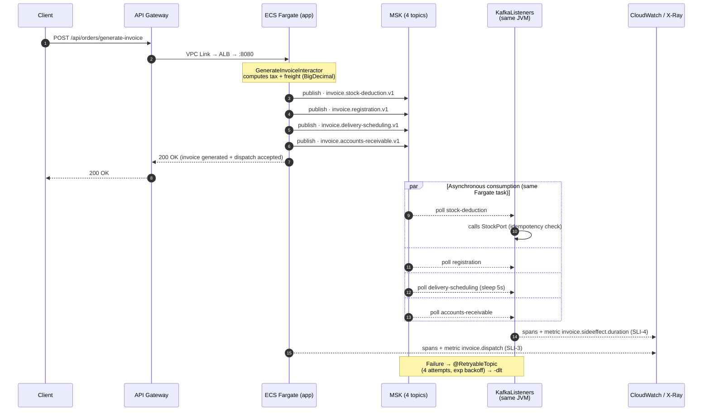

# AWS Architecture — Diagrams (F-AWS)

Visual companion to the architecture proposed in F-AWS. The full write-up
(services map, ADRs, cost, runbook) lives in
[`aws-architecture.md`](aws-architecture.md); spec and tasks in
[`.specs/features/aws/`](../.specs/features/aws/).

Three diagrams at increasing zoom levels: the **main** one gives you the
10-second read, the **structural** one shows every AWS service and how it maps
to the local stack, and the **sequence** one explains the synchronous-HTTP /
asynchronous-side-effects twist.

> **For presentation in draw.io with real AWS icons:** open
> [`aws-architecture-diagrams.drawio`](aws-architecture-diagrams.drawio) — four
> pages (Main, Structural, Sequence, Architecture-reviewer) using the native
> `mxgraph.aws4.*` AWS shape stencils. The mermaid blocks below are the
> canonical, version-controlled source for GitHub rendering; draw.io's mermaid
> importer sanitizes inline HTML, so AWS icons can't be embedded into the
> mermaid itself.

---

## Main Diagram — context view

10-second read: who talks to whom, where the AWS boundary is, and what the
three planes are (request, messaging, observability).

**The story in one sentence:** the client hits the managed edge, Fargate
computes the invoice and publishes 4 events to MSK, the same containers consume
those events in the background, and everything flows to CloudWatch + X-Ray
without any AWS-specific code in the application.

**What each plane is:**

- **Edge — API Gateway + ALB.** Managed HTTPS termination at the boundary (API
  Gateway HTTP API), private Layer-7 routing to Fargate (internal ALB). No
  authorizer at the edge — JWT validation lives in the Spring filter chain
  (ADR-032).
- **Compute — ECS Fargate (Spring Boot).** Containers without managing EC2
  hosts. Each task runs the full app *and* its Kafka consumers in the same
  JVM, so the HTTP path and the async path share one trace (ADR-030).
- **Messaging — Amazon MSK (4 topics).** AWS-hosted Kafka, one topic per
  downstream integration (`stock-deduction`, `registration`,
  `delivery-scheduling`, `accounts-receivable`). Picked over SQS to keep the
  application code byte-identical between local and AWS (ADR-029).
- **Observability — CloudWatch + X-Ray.** Logs, metrics, traces. The four
  SLIs from F-OBSERVABILITY are republished into CloudWatch metric math —
  same definitions, different query language.

---

## Diagram 1 — Structural (what runs on AWS)

Every AWS service, its network boundaries, and what it replaces from the local
`docker compose`.

**What each node is:**

- **API Gateway HTTP API.** Managed HTTPS endpoint (v2 — ~70 % cheaper than
  REST API). No authorizer (ADR-032).
- **VPC Link.** Managed networking primitive that lets the public API Gateway
  reach a *private* ALB via ENIs inside the VPC — keeps the ALB off the
  internet.
- **Internal ALB.** Private Layer-7 load balancer; runs the
  `/actuator/health` check ECS uses to know whether a task is alive.
- **app container (Spring Boot 3.5).** The JVM with HTTP server + Kafka
  consumers in the same process. Spring profile `aws` activates the
  CloudWatch registry and the OTLP exporter — code path is otherwise
  profile-agnostic.
- **ADOT sidecar.** AWS Distro for OpenTelemetry — an OTel collector that
  receives OTLP from the app on `localhost:4318` and forwards spans to
  X-Ray. Vendor-neutral: tomorrow we can swap X-Ray for Jaeger/Honeycomb
  with a sidecar config change, zero app change.
- **MSK brokers (3 × kafka.t3.small, one per AZ).** Replication factor 3
  with `min.insync.replicas=2` — one AZ can be lost without data loss.
  ~US$ 200/mo at idle, the dominant line item in the proposal (ADR-033 is
  why this isn't applied against a real account).
- **SASL/IAM :9098.** Authentication mechanism used by Spring Kafka against
  MSK. Each Kafka call is signed with AWS SigV4 using the **ECS task role's
  credentials** — *no long-lived secrets in the app config*.
- **ECR.** Private Docker registry the Fargate task pulls from on start.
- **KMS CMK (at-rest MSK).** Customer-Managed Key (legacy term for "KMS
  key") that encrypts the data MSK persists to broker disks. Customer-managed
  (not the default `aws/msk` key) so *you* control rotation, revocation, and
  the CloudTrail audit trail — matters for CPF/CNPJ on invoices (LGPD).
- **CloudWatch Logs.** Three log groups: `/aws/ecs`, `/aws/msk`,
  `/aws/apigateway`. App ships JSON logs via the `awslogs` driver — no
  Firelens sidecar (ADR-031). Queryable by `correlationId` in CloudWatch
  Logs Insights.
- **CloudWatch Metrics + Dashboard.** Micrometer registry publishes to
  namespace `InvoiceGenerator` every minute. The dashboard renders the four
  SLIs via metric math — no SLI math lives in the application.
- **AWS X-Ray (10 % sampling).** Distributed traces. 10 % sampling keeps the
  bill bounded (~US$ 15/mo at proposal traffic) while keeping enough samples
  for performance debugging.

---

## Diagram 2 — Sequence (synchronous HTTP + asynchronous side-effects)

The architectural "twist": `POST /generate-invoice` responds **fast** after
dispatching 4 events to MSK; the consumers run **inside the same Fargate
task**, so the trace continues.

**Reading the sequence:**

- **HTTP success ≠ downstreams completed.** The 200 OK at step 7 means
  "invoice generated + 4 events dispatched" — *not* "stock deducted +
  registration filed + delivery scheduled + AR opened". This is the
  deliberate fix from F-DEFECTS-PERFORMANCE / C-6: a slow downstream
  (delivery's `Thread.sleep(5000)`) no longer pegs HTTP P99.
- **Async consumption stays inside the same Fargate task.** The
  `@KafkaListener` consumers run in the same JVM as the HTTP server — so
  the OTel trace continues from publish to consume without fragmenting
  across processes (ADR-030's payoff).
- **Per-topic retry/DLT via `@RetryableTopic`.** A consumer failure auto-
  creates retry topics (4 attempts, exponential backoff) and lands on
  `<topic>-dlt` if all retries exhaust. This is a **Spring Kafka client-side**
  concept — MSK only hosts the topics, no AWS config involved. Same retry
  semantics as the local Kafka stack.
- **Idempotency is in-memory (debt).** The consumer dedupes on
  `(topic, eventId)` before calling the port, but the store is a
  `ConcurrentHashMap` — a task restart loses the cache. Flagged as `AD-024`
  for Redis/DynamoDB.
- **SLI-3 (`invoice.dispatch`) and SLI-4 (`invoice.sideeffect.duration`)**
  are the metrics that observe this asynchronous path. They exist precisely
  because the API SLO can't.

---

## Presentation script (~5 min)

1. **Open with the Main Diagram** — situate the audience across the four planes (edge → compute → messaging → observability) in 30 seconds.
2. **Drill into Diagram 1** and tell two ADRs with real trade-offs: why **MSK and not SQS** (fidelity + zero code change) and why **Fargate and not Lambda** (long-lived consumer in the same trace).
3. **Show Diagram 2** — emphasize that HTTP returns without waiting for downstreams, and that retry/DLT is native to Spring Kafka.
4. **Close on observability** — the 4 SLIs from F-OBSERVABILITY are reused verbatim as CloudWatch metric math (no rederiving the formulas) and the alarms exist without action because SNS/PagerDuty is the next step.
5. If the question **"why isn't it deployed?"** comes up — ADR-033: proposal-grade costs ~US$ 0; applyable would cost ~US$ 200/mo of MSK just to watch `terraform apply` run.
