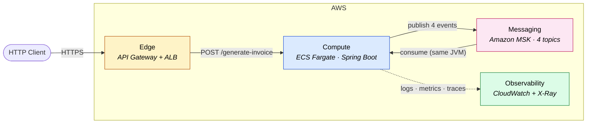
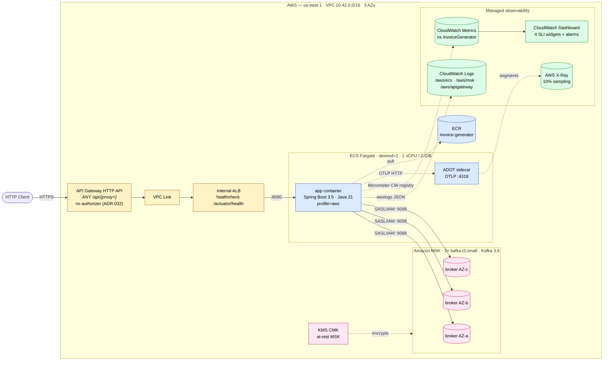
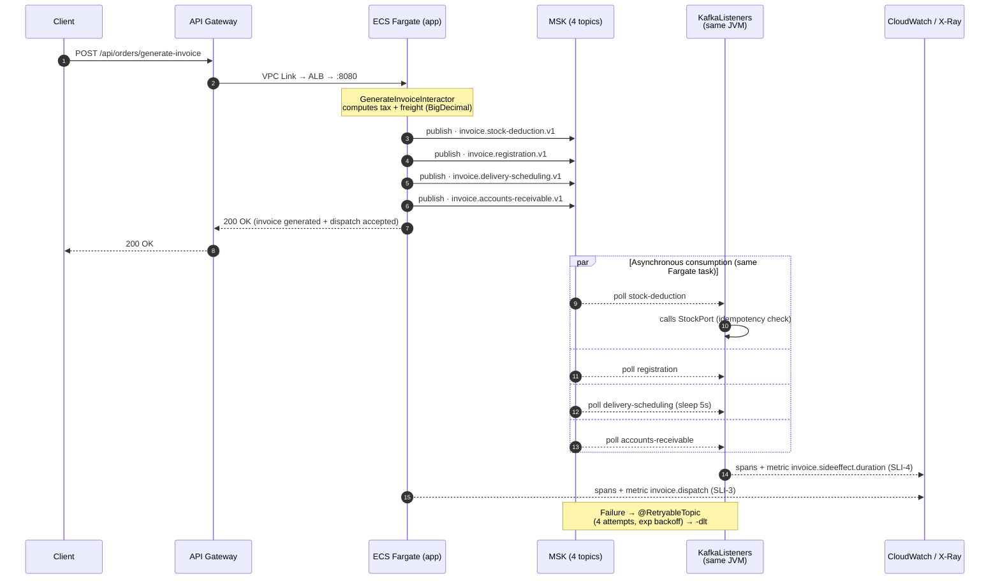

# AWS Architecture — Diagrams (F-AWS)

Visual companion to the architecture proposed in F-AWS. The full write-up
(services map, ADRs, cost, runbook) lives in
[`aws-architecture.md`](aws-architecture.md); spec and tasks in
[`.specs/features/aws/`](../.specs/features/aws/).

Three diagrams at increasing zoom levels: the **main** one gives you the
10-second read, the **structural** one shows every AWS service and how it maps
to the local stack, and the **sequence** one explains the synchronous-HTTP /
asynchronous-side-effects twist.

> **Rendering notes.** The Main and Structural diagrams embed AWS official
> architecture icons via `` tags hosted on `icon.icepanel.io` (a public
> CDN mirror of AWS's freely licensed icon set), so they render with the right
> AWS iconography in any mermaid v10+ renderer that honors HTML labels —
> including GitHub, mermaid.live, and draw.io (Arrange → Insert → Advanced →
> Mermaid). No iconify icon pack registration is required. The Sequence
> diagram is intentionally icon-free: sequence semantics describe interaction
> order, not topology.

---

## Main Diagram — context view

10-second read: who talks to whom, where the AWS boundary is, and what the
three planes are (request, messaging, observability).

**The story in one sentence:** the client hits the managed edge, Fargate
computes the invoice and publishes 4 events to MSK, the same containers consume
those events in the background, and everything flows to CloudWatch + X-Ray
without any AWS-specific code in the application.

---

## Diagram 1 — Structural (what runs on AWS)

Every AWS service, its network boundaries, and what it replaces from the local
`docker compose`.

**Talking points (one sentence each):**

- **Edge:** API Gateway HTTP API → VPC Link → internal ALB. Auth deliberately deferred (ADR-032).
- **Compute:** Fargate instead of Lambda **because the app holds long-lived Kafka consumers in the same JVM** (ADR-030) — keeps HTTP and consumer in the same trace.
- **Messaging:** MSK instead of SQS to preserve fidelity with the local KRaft Kafka stack — application code does not change (ADR-029).
- **Observability:** logs via `awslogs` (no Firelens, ADR-031), metrics via the Micrometer CloudWatch registry, traces via ADOT → X-Ray. The **4 SLIs from F-OBSERVABILITY** map 1:1 to metric math on the dashboard.
- **Security:** SASL/IAM on MSK (no secrets), KMS CMK at-rest, layered SGs (ALB→app→MSK).

---

## Diagram 2 — Sequence (synchronous HTTP + asynchronous side-effects)

The architectural "twist": `POST /generate-invoice` responds **fast** after
dispatching 4 events to MSK; the consumers run **inside the same Fargate
task**, so the trace continues.

**Talking points:**

- **HTTP success = "generated + dispatch accepted"**, not "downstreams completed" — deliberate choice (F-DEFECTS-PERFORMANCE / C-6).
- **Per-topic retry/DLT** already exists in the app (`@RetryableTopic`); MSK only hosts. No code changes between local and AWS.
- **Idempotency** is currently in-memory (`AD-024`) — flagged as debt for Redis/DynamoDB.
- **SLI-3 and SLI-4** are precisely the metrics that cover this asynchronous path.

---

## Presentation script (~5 min)

1. **Open with the Main Diagram** — situate the audience across the four planes (edge → compute → messaging → observability) in 30 seconds.
2. **Drill into Diagram 1** and tell two ADRs with real trade-offs: why **MSK and not SQS** (fidelity + zero code change) and why **Fargate and not Lambda** (long-lived consumer in the same trace).
3. **Show Diagram 2** — emphasize that HTTP returns without waiting for downstreams, and that retry/DLT is native to Spring Kafka.
4. **Close on observability** — the 4 SLIs from F-OBSERVABILITY are reused verbatim as CloudWatch metric math (no rederiving the formulas) and the alarms exist without action because SNS/PagerDuty is the next step.
5. If the question **"why isn't it deployed?"** comes up — ADR-033: proposal-grade costs ~US$ 0; applyable would cost ~US$ 200/mo of MSK just to watch `terraform apply` run.
